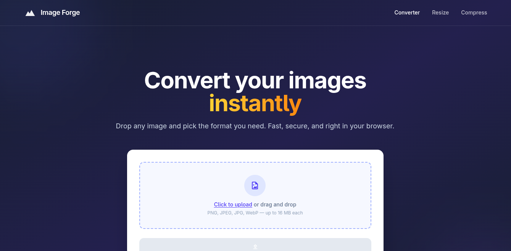

# Image Forge

  

  <a href="https://image-forge-lfoh.onrender.com"><strong>image-forge-lfoh.onrender.com</strong></a>

A free online image conversion tool — convert images to JPG, PNG, or WebP instantly. All processing happens in memory, nothing is written to disk.

Built with **Laravel 13**, **Livewire 4**, **Alpine.js**, and **Tailwind CSS 4**.

## Features

- **Image Converter** — Upload images and convert between JPG, JPEG, PNG, and WebP formats
- **In-Memory Processing** — Converted images are served from memory, never stored on disk
- **No Sign-Up Required** — Fully public and free to use

## Pages

| Route | Page | Status |
|-------|------|--------|
| `/` | Image Converter | Live |
| `/resizer` | Image Resizer | Coming Soon |
| `/compressor` | Image Compressor | Coming Soon |

## Tech Stack

| Layer | Technology |
|-------|-----------|
| Backend | Laravel 13, PHP 8.5+ |
| Frontend | Livewire 4, Alpine.js, Tailwind CSS 4 |
| Image Processing | Intervention Image 4 |
| Icons | Iconify (@iconify/tailwind4) |
| Build | Vite + @tailwindcss/vite |
